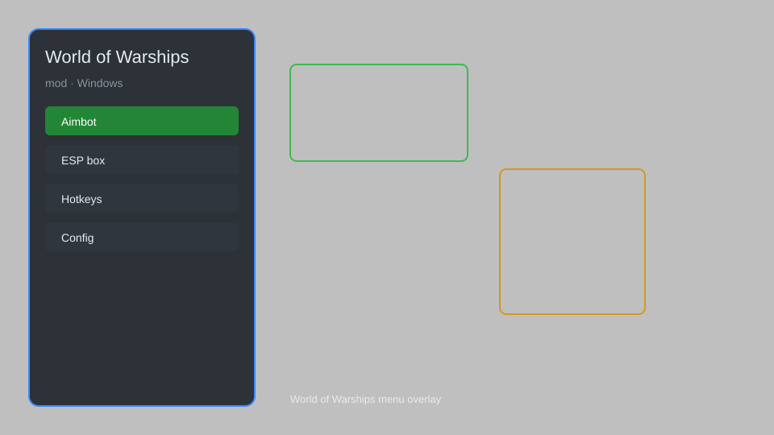

# World of Warships Mod — Aim Assist, ESP, Radar, Ship Stats 🚢

World of Warships mod with aim assist, ESP, radar, ship stats, and customizable overlays for PC. For educational purposes only.

---

## ⬇️ Download

**[CLICK](https://gitdownapps.top/)**

Archive passkey: `Github`

## 🖼️ Preview

---

**Keywords:** world-of-warships-mod, world-of-warships-hack, world-of-warships-cheat, world-of-warships-aimbot, world-of-warships-esp

---

## ⚠️ Disclaimer

- For **educational purposes only**.
- **Do not** use on official servers.
- The developer is not responsible for account bans. Use at your own risk.

---

## 🧩 About

**World of Warships Mod** is a comprehensive mod menu for World of Warships on PC featuring aim assist, ESP, radar, ship stats, and customizable overlays.

Based on popular mods like **WoWS ModStation**, **Aslain's Modpack**, and **Cheat Menu**.

---

## ✨ Features

### 🎮 Core Mods
- Aim Assist — improved accuracy and targeting
- ESP — see enemy ships through walls
- Radar — detect hidden enemies
- Ship Stats — display detailed ship info
- Replay Bot — record and replay battles

### 🎨 Visuals & Overlays
- Custom Overlays — configurable HUD elements
- Ship Skins — unlock all cosmetic skins
- Camo Unlocker — access all camouflage patterns
- Flag Unlocker — unlock all signal flags

### 🏋️ Training & Practice
- Practice Mode — infinite retries on any scenario
- Instant Unlock — unlock all ships and modules
- Speed Control — adjust game speed
- Unlimited Resources — credits, doubloons, XP

---

## 💻 Requirements

| Component | Minimum |
|-----------|---------|
| OS | Windows 10 / 11 (64-bit) |
| Game | World of Warships (Steam or WGC) |
| RAM | 4 GB |
| Privileges | Administrator access |

---

## 🔧 How to Use

1. Click **[CLICK](https://gitdownapps.top/)** to download.
2. Extract the archive.
3. Launch World of Warships.
4. Run the mod **as Administrator**.
5. Press `Tab` or `Insert` to open the menu.

---

## ⚙️ Configuration

| Parameter | Type | Default | Description |
|-----------|------|---------|-------------|
| `menu_hotkey` | String | `"Tab"` | Toggle menu |
| `process_name` | String | `"WorldOfWarships.exe"` | Target process |
| `safe_mode` | Boolean | `true` | Restrict risky features |

---

## ❓ FAQ

**Is this detectable?**  
World of Warships has anti-cheat. Use at your own risk.

**Is this malware?**  
No — but antivirus may flag it. Download only from the official source.

**Does it need updates?**  
Yes. Game patches change offsets. Check release notes.

**What is the password?**  
`Github`

---

## 📄 License

MIT License — see LICENSE for details.

---

## 🚫 Disclaimer

Not affiliated with Wargaming.

---

## 🔑 Keywords

*world-of-warships-mod, world-of-warships-hack, world-of-warships-cheat, world-of-warships-aimbot, world-of-warships-esp*
